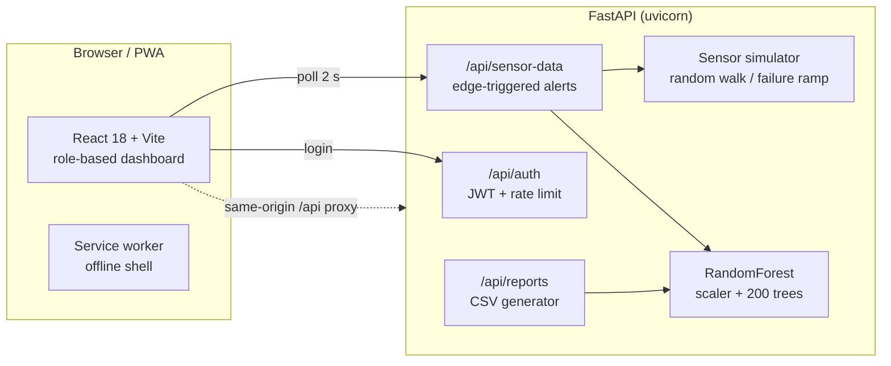

<div align="center">


# VigiRail

**Railway asset health & predictive maintenance platform**

Real-time rolling-stock telemetry · Random Forest failure prediction · role-based operations console · installable PWA

[](https://github.com/sami7507/railway-predictive-maintenance-system/actions/workflows/ci.yml)
[](https://www.python.org/)
[](https://fastapi.tiangolo.com/)
[](https://react.dev/)
[](LICENSE)

</div>

---

## Overview

VigiRail monitors railway rolling stock the way a modern control room would: sensor
telemetry streams into a FastAPI backend, a Random Forest model scores the failure risk
of each snapshot, and a role-based dashboard tells every stakeholder exactly what it
means — from a plain-language go/no-go view for operators to full model explainability
for engineers.

The system ships with a **simulated IoT layer** (vibration, bearing temperature,
acoustic emission, wear) calibrated against published RDSO / Railway Board thresholds,
so the whole pipeline — ingestion → inference → alerting → reporting — runs end to end
without hardware.

> Built to be demoed: four login roles, a failure-injection switch that drives the fleet
> into the danger zone in ~35 seconds, real CSV inspection reports, and an offline-capable
> installable PWA.

## Features

| Area | What's included |
|---|---|
| **Live telemetry** | 2-second sensor polling, per-bogie bearing status, route progress with current station, rolling trend charts |
| **Failure prediction** | `StandardScaler → RandomForest` (200 trees), stratified 80/20 hold-out evaluation, deterministic inference, class probabilities per sample |
| **Alerting** | Edge-triggered alerts on state *transitions* (no spam), severity levels, recovery notices, server-side "alerts today" counter |
| **RBAC** | 4 roles (Admin, Engineer, Operator, Inspector) enforced at the API with JWT + per-route role guards |
| **Failure simulation** | Engineer/Admin-only switch that ramps the whole sensor stream through advisory into critical |
| **Reports** | Server-generated CSV inspection reports (opens in Excel/Sheets) + print-to-PDF view |
| **System introspection** | Live API status, latency, endpoint reference, raw response inspector, interactive OpenAPI at `/docs` |
| **PWA** | Installable on iOS/Android/desktop, service-worker precache, offline shell + connection banners |
| **Security** | PBKDF2 password hashing, HS256 JWT (algorithm pinned), login rate limiting, explicit CORS allow-list, security headers, request IDs |

## Architecture



**Request flow:** `simulator → scaler → forest → classified snapshot → UI`, all scored
server-side. The browser never fabricates telemetry.

## Tech stack

| Layer | Choice |
|---|---|
| Backend | Python 3.11 · FastAPI · Uvicorn · Pydantic v2 |
| ML | scikit-learn · NumPy (training at startup, ~0.7 s) |
| Auth | OAuth2 password flow · HS256 JWT (stdlib) · PBKDF2-HMAC-SHA256 |
| Frontend | React 18 · React Router 6 · Chart.js · Axios · Vite 6 |
| PWA | vite-plugin-pwa (Workbox precache) |
| Quality | pytest — 33 API tests · Vitest + Testing Library — 16 UI tests · Ruff · GitHub Actions CI |
| Deploy | Render (API, Docker) · Vercel (web) · Docker Compose (self-host) |

## Quick start

### Prerequisites
Python 3.11+ and Node.js 20+

### 1. Backend

```bash
cd backend
python -m venv .venv && source .venv/bin/activate   # Windows: .venv\Scripts\activate
pip install -r requirements-dev.txt
uvicorn app.main:app --reload --port 8000
```

API: `http://localhost:8000` · OpenAPI docs: `http://localhost:8000/docs`

### 2. Frontend

```bash
cd frontend
npm install
npm run dev
```

Dashboard: `http://localhost:5173` (the dev server proxies `/api` → `:8000`)

### 3. Tests

```bash
cd backend && pytest     # API, RBAC, ML, report tests (33)
cd frontend && npm test  # component & helper tests (16)
```

## Demo credentials

| Username | Password | Role | Sees |
|---|---|---|---|
| `admin` | `admin123` | Admin | Everything incl. simulation control & reports |
| `engineer` | `eng456` | Engineer | Telemetry, model, system, failure simulation |
| `operator` | `ops789` | Operator | Simplified operational view + guidance |
| `inspector` | `insp321` | Inspector | History, alerts, inspection reports |

> Demo accounts are defined server-side with PBKDF2 hashes (`backend/app/core/users.py`).

## API reference

Interactive docs: **`/docs`** (Swagger UI). Core endpoints:

| Method | Endpoint | Auth | Description |
|---|---|---|---|
| `POST` | `/api/auth/login` | — | Issue JWT (rate-limited) |
| `GET` | `/api/auth/me` | Bearer | Token identity |
| `GET` | `/api/sensor-data?train=` | Bearer | Live snapshot + model output + route |
| `POST` | `/api/predict` | Admin/Engineer | Score an arbitrary snapshot |
| `GET` | `/api/model` | Admin/Engineer | Training metrics & importances |
| `GET` | `/api/history?limit&offset&train` | Bearer | Paginated readings |
| `GET` | `/api/alerts` | Bearer | Alert stream |
| `GET` | `/api/trains` | Bearer | Fleet catalogue with routes |
| `POST` | `/api/simulate` | Admin/Engineer | Failure injection on/off |
| `GET` | `/api/reports/inspection?train&format` | Admin/Inspector | CSV/JSON report |
| `GET` | `/api/status` · `/healthz` | — | Status & readiness probe |

## ML model

- **Pipeline:** `StandardScaler → RandomForestClassifier` (200 trees, depth 10, balanced classes)
- **Training data:** 4,000 synthetic samples drawn from RDSO-calibrated ranges
  (vibration RDSO/2019/CG-06 · bearing temp IS 3073 · acoustic IEC 60721 · wear RDSO
  track-maintenance limits), with Gaussian sensor noise (σ = 0.6) and 5 % label noise
  so classes overlap the way field data does
- **Evaluation:** stratified **80/20 hold-out** — the dashboard reports *test* metrics
  (≈ 94.5 % accuracy, macro-F1 ≈ 0.93), never train-set accuracy
- **Inference:** deterministic — identical inputs always return identical scores;
  component risks are a documented decomposition of the model output over normalised
  sensor values
- **Production path:** replace `app/ml/model.py:_generate_training_data()` with logged
  wayside sensor data; the training/eval code stays the same

## Deployment (free)

### API → Render

1. Push this repository to GitHub.
2. Render → **New → Blueprint** → select the repo (reads `render.yaml`).
   It creates `vigirail-api` as a Docker service with a generated
   `VIGIRAIL_SECRET_KEY` and `/healthz` health checks.
3. Note the URL: `https://vigirail-api.onrender.com`.

### Web → Vercel

1. Vercel → **Add New Project** → import the same repo → set **Root Directory** to
   `frontend/` (framework: Vite is auto-detected).
2. Edit `frontend/vercel.json` and replace `https://vigirail-api.onrender.com` with
   your real Render URL (this proxies `/api` same-origin — no CORS setup needed).
3. Deploy. Install the PWA from the mobile browser menu → **Add to Home screen**.

> Alternative: `docker compose up --build` runs the whole stack locally behind nginx
> on `http://localhost:8080` (set `VIGIRAIL_SECRET_KEY` first).

### Environment variables

| Variable | Where | Purpose |
|---|---|---|
| `VIGIRAIL_SECRET_KEY` | Render | JWT signing key (auto-generated by the blueprint) |
| `VIGIRAIL_ENVIRONMENT` | Render | `production` enforces an explicit secret |
| `VIGIRAIL_CORS_ORIGINS` | Render | Only needed for cross-origin setups |
| `VITE_API_URL` | Vercel (optional) | Override API base; default is same-origin `/api` |

## Project structure

```
├── backend/
│   ├── app/
│   │   ├── api/           # auth · telemetry · predict · fleet · reports · system
│   │   ├── core/          # config · security (JWT/PBKDF2/rate limit) · deps · users
│   │   ├── ml/            # RandomForest training & inference
│   │   ├── models/        # Pydantic schemas · fleet dataset
│   │   └── services/      # simulator · thread-safe state · telemetry pipeline
│   ├── tests/             # 33 pytest cases (auth, RBAC, telemetry, reports)
│   ├── Dockerfile
│   └── requirements*.txt
├── frontend/
│   ├── src/
│   │   ├── components/    # AppShell · Icon · common · dashboard · charts
│   │   ├── context/       # Auth · Sensor (poller) · Toast
│   │   ├── lib/           # api client · helpers · nav config
│   │   ├── pages/         # Login · Overview · Model · System · History · Reports
│   │   └── styles/        # design tokens + component/layout CSS
│   ├── vite.config.js     # PWA manifest + service worker + /api proxy
│   └── Dockerfile         # static build → nginx (self-host)
├── render.yaml            # Render blueprint (API)
├── docker-compose.yml     # one-command self-host stack
└── .github/workflows/     # CI: ruff + pytest + vite build
```

## Notable engineering decisions

- **Edge-triggered alerting** — alerts fire on state *transitions* (plus a 40 s
  reminder while critical), not on every poll, so the feed stays meaningful.
- **Thread-safe in-memory store** — FastAPI sync routes run in a thread pool; all
  shared mutation goes through locks, with documented swap-in points for Redis/Postgres.
- **Same-origin `/api` by default** — Vercel rewrites / nginx proxy mean the SPA never
  needs CORS in production; the CORS allow-list stays explicit (no wildcards).
- **Honest metrics** — hold-out evaluation, overlapping classes and label noise keep
  reported accuracy credible; identical inputs → identical outputs.
- **Polling pauses when hidden** — the telemetry loop stops on `visibilitychange`,
  saving battery and backend load when the app is backgrounded on a phone.

## License

MIT — see [LICENSE](LICENSE).

<div align="center">
Made with FastAPI, React and scikit-learn · <b>VigiRail</b>
</div>
